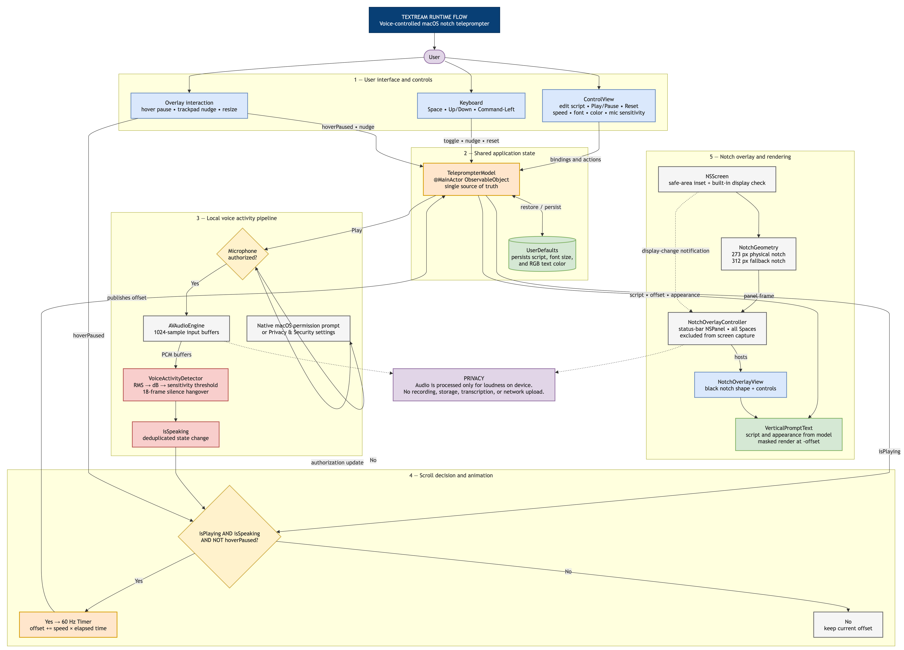

# Textream architecture

This diagram documents Textream's runtime flow from user input through local voice detection, scroll gating, notch-window placement, and final text rendering.

## Reading the diagram

1. SwiftUI and AppKit controls update one shared `TeleprompterModel`.
2. `UserDefaults` restores and persists script appearance settings.
3. With microphone permission, `AVAudioEngine` supplies local audio buffers to `VoiceActivityDetector`.
4. Scrolling advances only while playback is active, speech is detected, and hover pause is inactive.
5. `NotchOverlayController` positions a private `NSPanel`; `VerticalPromptText` renders the script using the model's current offset.

Audio is used only to calculate loudness on device. Textream does not record, store, transcribe, or upload audio.

The `.drawio` source remains editable in draw.io desktop or [diagrams.net](https://app.diagrams.net/).
